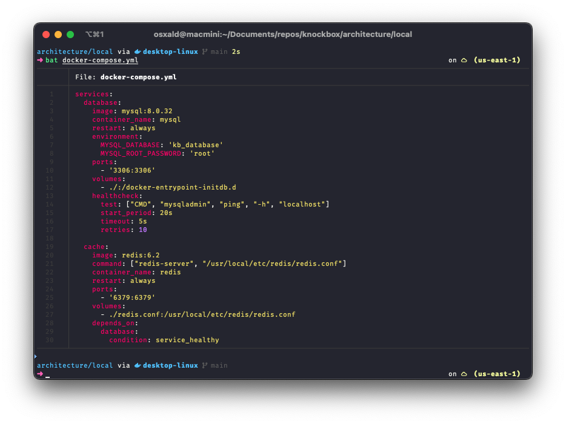
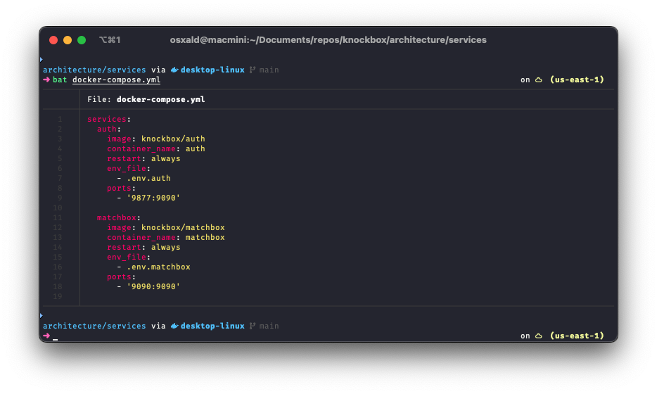
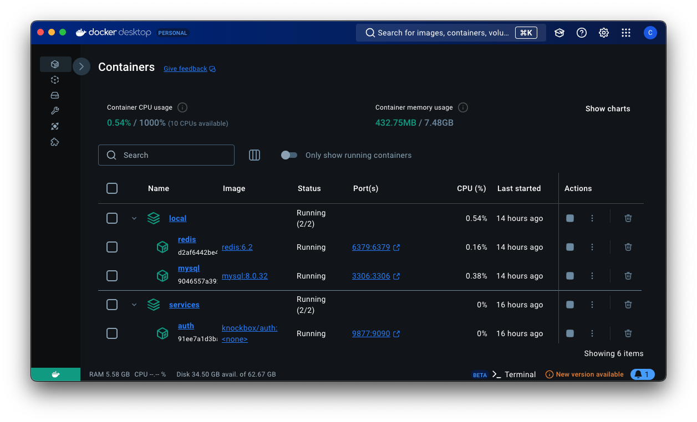

# KnockBox - Admin Guide

This guide assumes you have access to the following repositories:

-   [knockbox/architecture](github.com/knockbox/architecture)
-   [knockbox/authentciation](github.com/knockbox/authentciation)
-   [knockbox/matchbox](github.com/knockbox/matchbox)
-   [knockbox/frontend](github.com/knockbox/frontend)

If not, you'll just have to take our word for it...

## AWS CLI

This will assume that you have configured you `awc cli` in order to develop services or access to an `IAM` access token for running the services.

## Docker Desktop

For all `local` development you will need `Docker Desktop` or a similar runtime in order to standup or build `images`.

We'll assume you're using `Docker` throughout this guide.

## Deployment

We won't be covering deployment since there are an endless number of ways to deploy our application.

Both the [knockbox/authentciation](github.com/knockbox/authentciation) and [knockbox/matchbox](github.com/knockbox/matchbox) services contain a `.Dockerfile` allowing you to build and publish a containerized image.

The [knockbox/frontend](github.com/knockbox/frontend) is configured for a static build meaning you can deploy it through `AWS S3` or any other means. There are likely a variety of providers that can deploy this directly with repository access.

### Local

To support the `authentication` and `matchbox` services, we'll need to standup a `mysql` and `redis` container. The [knockbox/architecture](github.com/knockbox/architecture) repository contains a directory called `local`.

It contains the `init.sql`, `docker-compose.yml` and `redis.conf`. We can navigate into this directory and run:

```shell
docker compose up -d
```

This will standup and configure the services based on the following `docker-compose.yml`



### Authentication

This `service` contains our `keyring` for rotating key-sets as well as any `user` endpoints. Once you've cloned this repository, you can build it with the following command:

```shell
docker build -t knockbox/auth .
```

You can run this container locally using the following command:

```shell
docker run -p 9877:9090 --env-file .env.docker-local knockbox/auth
```

Or during development using:

```shell
go run main.go -denv -addr :9877
```

### Matchbox

This `service` contains all the endpoints for `events`, `flags`, and managing `cloud resources`. You will need a `GitHub Access Token` configured with read access for `knockbox/authentication` since we utilize it in our `goprivate` for code-reuse.

You can then build it with the following command:

```shell
docker build -t knockbox/matchbox --build-arg GITHUB_TOKEN=${GITHUB_TOKEN_KB} .
```

You can run this container locally using the following command:

```shell
docker run -p 9090:9090 --env-file .env.docker-local knockbox/matchbox
```

Or during development using:

```shell
go run main.go -denv
```

We can omit `-addr :9090` since we bind to it by default.

### Services

If we have both the `authentication` and `matchbox` services built locally, we can stand them up using the `docker-compose.yml` found in the `services` directory.

It contains the `init.sql`, `docker-compose.yml` and `redis.conf`. We can navigate into this directory and run:

```shell
docker compose up -d
```

This will standup and configure the services based on the following `docker-compose.yml`



The `.env` files are copies of the `.env.docker-local` files found in each services respective repository.

The only difference is the `.env.matchbox` file conatins entries for:

```shell
AWS_SECRET_KEY_ID=""
AWS_SECRET_ACCESS_KEY=""
AWS_REGION=""
```

These can be configured by providing an `IAM` `access token`.

With everything up and running successfully you should see something similar in your `Docker Desktop`:



### Frontend

Our `frontend` is an `Angular 17` application. We have configured it for static builds which allows us to deploy it simply through `S3` on `AWS`.

#### Local Frontend

You can clone the [knockbox/frontend](github.com/knockbox/frontend) repository and installed the `node_modules` using `npm i`.

Once done you can start the app using:

```shell
ng serve -c development
```

This will launch the app using the `development` `environment` configured to connect to our services deployed locally.
