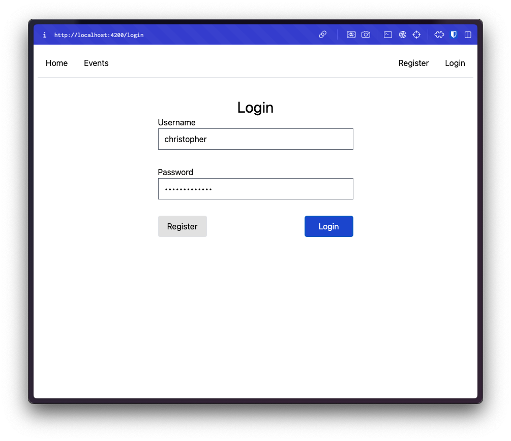

# KnockBox - User Guide

This guide covers how a User can interact with the Web Interface.

## Landing and Login

When first browsing to the KnockBox page, you will be greeted with the navbar as well as a hero text directing you to _Register_ or _Login_.

We'll assume you understand the basics of account registration and you should now be able
to _Login_ with the username and `password` you `provided` during registration.

## Events Overview

Once logged in, you'll be directed to the `Events Overview` page containing all the currently active and inactive events which we'll call `Event Cards`.

Each of these `Event Cards` contains the following at a glance information:

-   The event Name
-   The event Start Date and Time
-   The event End Date and Time
-   The event Activity Id
-   The event access (public or private)

## Event Details

Clicking one of these `Event Cards` will take us to the `Event Details` page which contains details regarding your `Instance` as well as `Scoring`.

This screen will change later when we are the `Event Organizer` but for now we'll look at what a `Participant` would see.

## Instance Management

Since this event is shows `Active` `Scoring` we'll go ahead and `Start` a `Task`. This will launch us our own personal `Instance` that we can access and begin exploting to find some `Flags`.

Clicking the `Blue` `Task Start` button will alert us that our `Task` is currently `Starting`.

We can refresh the `Status` of our `Task` by clicking the `Refresh Icon` next to the `Instance Details` header.

We'll know our `Instance` is `Ready` when we are displayed a `Green` `Ip Address` in the `Status`. Clicking this `Status` will copy the `Ip Address` to our `Clipboard`.

We can then perform our reconnosance and attempt to find any `Flags`. If we find one, we can submit it in the `Capture Flag` field and we'll get an `Alert` with a success or failure message.

Once we're done, or maybe we would like to restart our `Instance`, we can click the `Red` `Stop Task` button.

This will alert us that the `Instance` is being shut down.

Clicking the `Refresh Icon` will update the `Status` of our `Instance`.

We'll know when our `Task` is fully stopped once the `Green` `Ip Address` `Status` is gone. This tends to linger around after we've stopped a `Task` while resources are destroyed.

## Event Creation

On the `Events Overview` page, if we wanted to `Create` our own `Event`. We could click the `Blue` `Create Button`.

We would then be directed to the `Event Create` page containing a form for us to define some details about our `Event`.

We'll then need to fill in the following fields:

-   Event name
-   Starts at
-   Ends at
-   Image namespace, repository and tag
    -   This is a redundant field for later configuration it is broken down as follows:
        -   `namespace`: the dockerhub image namespace: e.g. `cesoun`
        -   `repository`: the dockhub image repo.: e.g. `demo-container-service`
        -   `tag`: the dockerhub image tag: e.g. `latest`
-   Event accessability
    -   This determines if anyone can join our event or if they need to be invited.

Once we've `Created` our `Event`, we can navigate back to the `Event Details` of our new `Event`.

This page should look somewhat familiar with two new sections: `Event Flags` and `Event Participants`.

This will additionally contain a `Blue` `Configure` button at the top right where we can `Configure` our `Event` `Containers`.

The `Event Flags` section contains a `Difficulty` selection and `Environment Variable` input field that we can use to define `Flags` that will be automatically set on our `Participant's` `Instance(s)` when started.

We can click `Toggle` on created `Event Flags` to view the `Environment Variable` that they are currently configured to.

We can additionally click the `Edit` on `Event Flags` to modify their `Difficulty` and `Environment Variable`. This will affect newly started `Instances` only. Clicking `Save` will commit these changes and `Cancel` will discard them.

This will also allow you to `Delete` the `Environment Variable` if it is not needed. Do note that this will affect any captured `Flags` by removing their `Scoring` as well.

At the bottom we'll see the `Event Participants` section containing an input field for `User Search` as well as all the `Invited Participants`.

In this case, we've search for `Users` with the `username` containing `john`. If we'd like to `Invite` them, we can click the `Invite` text next to their username.

## Event Configuration

If we click the blue `Configuration` button in the top right of our `Event Details`. We'll
be taken to the `Event Configuration` form.

This form contains the following fields:

-   `DockerHub Image`
    -   This can be input as a single string: e.g. `cesoun/demo-container-service`
-   `Essential`
    -   Determines if the container is requried to run.
    -   You'll need at least `1` essential container.
-   `Add Env Var`
    -   Adds a `Environment Variable` field.
    -   You may add as many as you need.
-   `Add Port`
    -   Adds a `Port` field.
    -   You may add as many as you need.
    -   Accepts: `http`, `http2` and `grpc`.
-   `Add Volume`
    -   Adds a `Volume` field.
    -   Only supports: `Elastic File System (EFS)`.
    -   Allows you to set the `Mounting Path` of the `Volume`.
-   `Add Container`
    -   Adds another `Container` field.
    -   Provides all the `Add Env Var`, `Add Port` and `Add Volume` buttons for additional configuration.
        -   These will be nested under the `DockerHub Image` field.
-   `Remove Container`
    -   This field is only present if more than `1` container is present.

This is what you'll see after clicking `Add Env Var`.

This is what you'll see after clicking `Add Port`.

This is what you'll see after clicking `Add Volume`.

This is what you'll see after clicking `Add Container`.

